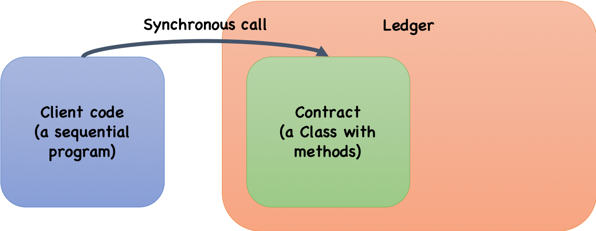
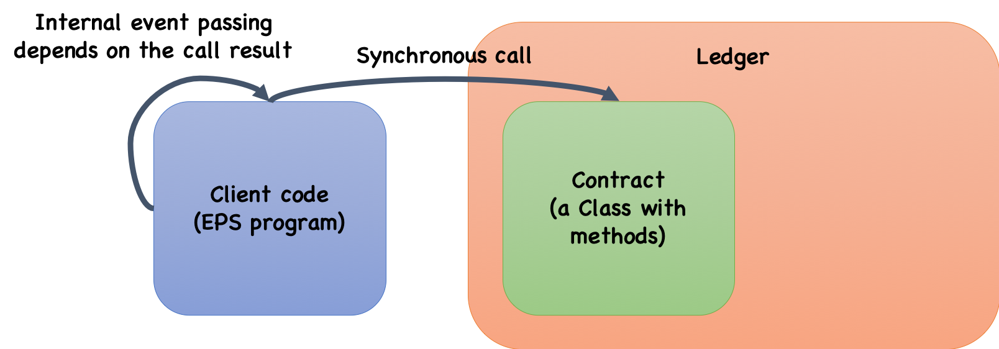
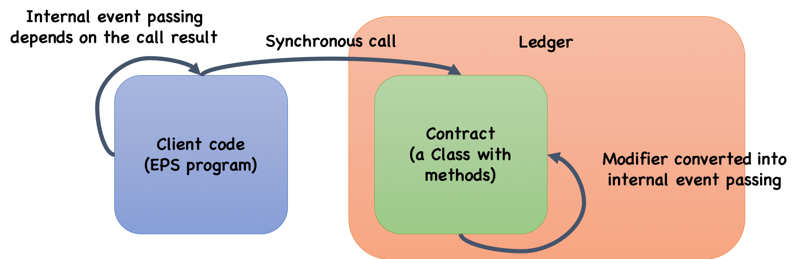

# Note

HTLCを論文での実証実験用に書き直しているプロジェクト。
以下の順番で試す。

## 準備

- **Node 10.x** を用意。ganache (というか keccak?) 関連のバグで、バージョンが8や12だと入らない。
- Python 2.x
- `npm i`

以下のテスト群はいずれも2窓で実行。

- 窓2: ganache起動。`npm run ganache-start`。 **テスト間で再起動しなくてよいはず。** テストが終わったら `Ctrl-C` で閉じる。

## (オリジナル) フルテスト

- 窓1: テスト。`npm test`

## (オリジナル) 単一台帳、単一コントラクト、単一クライアント



- 窓1: テスト。`npm run test:htlc`

## 単一台帳、単一コントラクト、単一クライアント (クライアント側EPS化)



`withdraw()` の成功・失敗と、`refund()` の成功・失敗について書き換えた。

- 窓1: テスト。`npm run test:htlc2`

## 単一台帳、単一コントラクト、単一クライアント (両方EPS化)



`withdraw()` の成功・失敗と、`refund()` の成功・失敗について書き換えた。

- 窓1: テスト。`npm run test:htlc3`
- 窓1: modifierテスト。`npm run test:htlc4`

ここからがデモるための最低条件

## 単一台帳、2コントラクト、単一クライアント (両方EPS化)

いま書いてる (まずはコントラクト側だけEPSで)

## 単一台帳、2コントラクト、単一クライアント (両方EPS化、enforced)

できればここまで

## 2台帳、2コントラクト、単一クライアント (両方EPS化、enforced)

## 2台帳、2コントラクト、2クライアント (両方EPS化、enforced)

## コントラクト変換

**いくつか仮定と制限をおく。**
TX が revert すると状態の変更ができないため。ただし、低レベルコールを使うと他のコントラクトを呼び出した結果がrevertしたかどうかを取れるらしい。ので、今回は時間が足りないが、やはりwrapperコントラクトとして状態機械を実装し、そちらで例外の処理と状態の管理をするのはよいと思う。

- revert しているメソッドを、revert しないものに書き換える。そのかわり TX の成功・失敗を返り値の末尾につけるとともに[成功・]失敗イベントを発生させる
- modifier ですべてのエラーチェックが済んでいて、本文ではエラーが起きないものとする (Solidity のbest practice にある内容なので、無茶な仮定ではないと思う)
- modifier の中身はすべて require 文である。
- emit があるとしたら return 文の直前にある。
- ~~内部変数を書き換えるアノテーション (modifier) が使えないので、関数本体に挿入する (もしくはwrapperで管理する) ことを想定。~~ うそ、pattern としてはあまりよくないが書くことは可能であるし、公式ドキュメントに例も見つけた。とりあえずは単一の遷移のみチェックするコードは実装した。

変換ルール

```
modifier m_1(...) {
  req_1;  // require statements
  req_2;
  ...;
  _;
}

constructor() {
  ...
}

// m_i は modifier
function f(args) m_1, m_2, ..., m_n returns T { 
  S;
  [emit ev;]
  return v_T;  // value of type T
} 
```

を

```
modifier init(q) {
  state = q
  _;
}

function find_transitions(transitions, current) returns (State) {
  ...;
}

modifier transitions(transitions) {
  next = find_transition(transitions, state);
  require(next != null);
  state = next;
  _;
}

function _m(...) internal returns (bool) {
  return req_1 && ... & req_n;
}

constructor init(q) {
  ...
}

function f(args) transition(transitions) returns (T, bool) { // state_check is modifier
  if !(_m_1(...) && ... && _m_n(...))return f_err()
  S
  return f_end(v_T)
}

function f_err() internal returns (T, bool) {
  emit f_err;
  return (*, false); // * is zero value of type T
}

function f_end(T v) internal returns (T, bool) {
  emit f_end;
  [emit ev;]
  return (v, true);
}
```

に変換

## クライアントコード変換

現時点での制限と仕様

- クライアントコードは sequential であるとする (Seller と Buyer のコードが1つになっている)
- テストフレームワークを使っているので、TX の成功は `Promise.resolve` として、失敗は例外として帰ってくる。成功時に発生したイベントは (イベントの購読ではなく) メソッド呼び出しの返り値として取れる。イベントの内容をこの方法で取ってこれるのかは不明。

変換ルール

まとまってないが、定義

```
C ::= <variables for contracts>
m ::= <methods of a contract>
S ::= x = C.m | x = e | try S catch (e) S | if e then S else S
    | others (function call, ...)
L ::= <label> S 
```

各 `S` について `<m, m_end, m_err><ここに入ってくるイベント、正常時のイベント、異常時のイベント>` が与えられたときに、

```
C.m() 

->

m() {
  try {
    C.m()
    raise m_end()
  } catch (e) {
    raise m_err(e)
  }
}
```

が基本形、`C.m` だけに注目すればいいのならもっとシンプルにできる


## オリジナルコード
# hashed-timelock-contract-ethereum

[](https://www.npmjs.org/package/ethereum-htlc)
[](https://travis-ci.org/chatch/hashed-timelock-contract-ethereum)

[Hashed Timelock Contracts](https://en.bitcoin.it/wiki/Hashed_Timelock_Contracts) (HTLCs) for Ethereum:

- [HashedTimelock.sol](contracts/HashedTimelock.sol) - HTLC for native ETH token
- [HashedTimelockERC20.sol](contracts/HashedTimelockERC20.sol) - HTLC for ERC20 tokens
- [HashedTimelockERC721.sol](contracts/HashedTimelockERC721.sol) - HTLC for ERC721 tokens

Use these contracts for creating HTLCs on the Ethereum side of a cross chain atomic swap (for example the [xcat](https://github.com/chatch/xcat) project).

## Run Tests
* Install truffle
* Install ganache [https://truffleframework.com/ganache](https://truffleframework.com/ganache)
* Launch and set the network ID to `4447`

```
$ npm i
$ truffle test
Using network 'test'.

Compiling ./test/helper/ASEANToken.sol...
Compiling ./test/helper/EUToken.sol...


  Contract: HashedTimelock
    ✓ newContract() should create new contract and store correct details (92ms)
    ✓ newContract() should fail when no ETH sent (84ms)
    ✓ newContract() should fail with timelocks in the past (78ms)
    ✓ newContract() should reject a duplicate contract request (159ms)
    ✓ withdraw() should send receiver funds when given the correct secret preimage (214ms)
    ✓ withdraw() should fail if preimage does not hash to hashX (111ms)
    ✓ withdraw() should fail if caller is not the receiver (162ms)
    ✓ withdraw() should fail after timelock expiry (1243ms)
    ✓ refund() should pass after timelock expiry (1273ms)
    ✓ refund() should fail before the timelock expiry (132ms)
    ✓ getContract() returns empty record when contract doesn't exist (48ms)

  Contract: HashedTimelockERC20
    ✓ newContract() should create new contract and store correct details (214ms)
    ✓ newContract() should fail when no token transfer approved (107ms)
    ✓ newContract() should fail when token amount is 0 (166ms)
    ✓ newContract() should fail when tokens approved for some random account (214ms)
    ✓ newContract() should fail when the timelock is in the past (136ms)
    ✓ newContract() should reject a duplicate contract request (282ms)
    ✓ withdraw() should send receiver funds when given the correct secret preimage (363ms)
    ✓ withdraw() should fail if preimage does not hash to hashX (227ms)
    ✓ withdraw() should fail if caller is not the receiver  (307ms)
    ✓ withdraw() should fail after timelock expiry (2257ms)
    ✓ refund() should pass after timelock expiry (2407ms)
    ✓ refund() should fail before the timelock expiry (283ms)
    ✓ getContract() returns empty record when contract doesn't exist (55ms)

  Contract: HashedTimelock swap between two ERC20 tokens
    ✓ Step 1: Alice sets up a swap with Bob in the AliceERC20 contract (233ms)
    ✓ Step 2: Bob sets up a swap with Alice in the BobERC20 contract (239ms)
    ✓ Step 3: Alice as the initiator withdraws from the BobERC20 with the secret (97ms)
    ✓ Step 4: Bob as the counterparty withdraws from the AliceERC20 with the secret learned from Alice's withdrawal (144ms)
    Test the refund scenario:
      ✓ the swap is set up with 5sec timeout on both sides (3613ms)

  Contract: HashedTimelock swap between ERC721 token and ERC20 token (Delivery vs. Payment)
    ✓ Step 1: Alice sets up a swap with Bob to transfer the Commodity token #1 (256ms)
    ✓ Step 2: Bob sets up a swap with Alice in the payment contract (231ms)
    ✓ Step 3: Alice as the initiator withdraws from the BobERC721 with the secret (95ms)
    ✓ Step 4: Bob as the counterparty withdraws from the AliceERC721 with the secret learned from Alice's withdrawal (132ms)
    Test the refund scenario:
      ✓ the swap is set up with 5sec timeout on both sides (3737ms)

  Contract: HashedTimelock swap between two ERC721 tokens
    ✓ Step 1: Alice sets up a swap with Bob in the AliceERC721 contract (225ms)
    ✓ Step 2: Bob sets up a swap with Alice in the BobERC721 contract (265ms)
    ✓ Step 3: Alice as the initiator withdraws from the BobERC721 with the secret (131ms)
    ✓ Step 4: Bob as the counterparty withdraws from the AliceERC721 with the secret learned from Alice's withdrawal (119ms)
    Test the refund scenario:
      ✓ the swap is set up with 5sec timeout on both sides (3635ms)


  39 passing (27s)
```

## Protocol - Native ETH

### Main flow


### Timelock expires


## Protocol - ERC20

### Main flow


### Timelock expires


## Interface

### HashedTimelock

1.  `newContract(receiverAddress, hashlock, timelock)` create new HTLC with given receiver, hashlock and expiry; returns contractId bytes32
2.  `withdraw(contractId, preimage)` claim funds revealing the preimage
3.  `refund(contractId)` if withdraw was not called the contract creator can get a refund by calling this some time after the time lock has expired.

See [test/htlc.js](test/htlc.js) for examples of interacting with the contract from javascript.

### HashedTimelockERC20

1.  `newContract(receiverAddress, hashlock, timelock, tokenContract, amount)` create new HTLC with given receiver, hashlock, expiry, ERC20 token contract address and amount of tokens
2.  `withdraw(contractId, preimage)` claim funds revealing the preimage
3.  `refund(contractId)` if withdraw was not called the contract creator can get a refund by calling this some time after the time lock has expired.

See [test/htlcERC20.js](test/htlcERC20.js) for examples of interacting with the contract from javascript.

### HashedTimelockERC721

1.  `newContract(receiverAddress, hashlock, timelock, tokenContract, tokenId)` create new HTLC with given receiver, hashlock, expiry, ERC20 token contract address and the token to transfer
2.  `withdraw(contractId, preimage)` claim funds revealing the preimage
3.  `refund(contractId)` if withdraw was not called the contract creator can get a refund by calling this some time after the time lock has expired.


